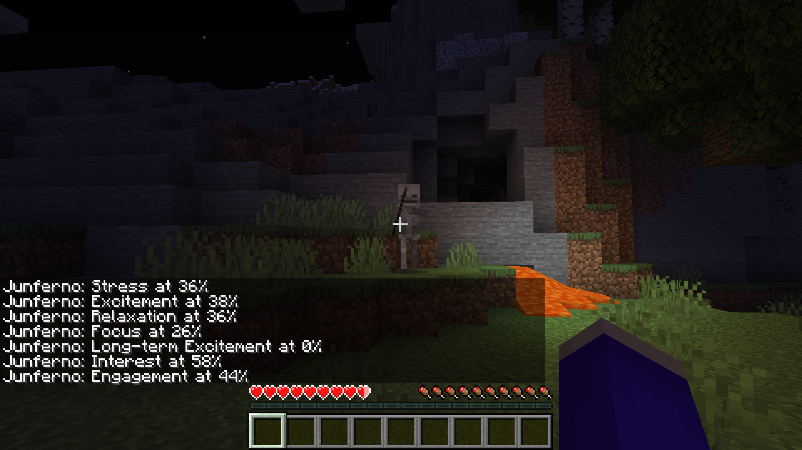

<p align="center">
  
</p>

Cortex API plugin for Minecraft. Uses Emotiv's Cortex API to make in-game adjustments in accordance to the user's brain-computer interface metrics. Demonstrates secure WebSocket connection protocol used in Cortex V2.

## Default Metrics and Attributes

| Entity | Attribute | Attribute Generic Name | Metric | Metric Code | Relationship |
| --- | --- | --- | --- | --- | --- |
| Player | **Movement Speed** | MOVEMENT_SPEED | **Excitement** | exc | Direct |
| Player | **Knockback Resistance** | KNOCKBACK_RESISTANCE | **Relaxation** | rel | Inverse |
| Player | **Max Health** | MAX_HEALTH | **Relaxation** | rel | Direct |
| Player | **Attack Damage** | ATTACK_DAMAGE | **Focus** | foc | Direct |
| Player | **Attack Speed** | ATTACK_SPEED | **Focus** | foc | Direct |
| Monster | **Movement Speed** | MOVEMENT_SPEED | **Stress** | str | Direct |
| Monster | **Follow Range** | FOLLOW_RANGE | **Stress** | str | Direct |
| Monster | **Attack Damage** | ATTACK_DAMAGE | **Engagement** | eng | Direct |

*Affects only the player with the Brain-computer Interface and Monsters within a 50 block radius of said player



## Configuration

### Requirements
 * Emotiv Headgear (Plugin tested with [INSIGHT](https://www.emotiv.com/insight/))
 * Emoiv App ([Emotiv Installer](https://www.emotiv.com/my-account/downloads/))
 * Java 15.X (Plugin tested with Java 15.0.1, [Download Page](https://java.com/en/download/))
 * Apache Maven 3.X (Plugin tested with Apache Maven 3.6.3, [Download Page](https://maven.apache.org/download.cgi))
 * Spigot Server ([Tutorial](https://minecraft.gamepedia.com/Tutorials/Setting_up_a_Spigot_server))

Download the [latest stable release](https://github.com/kevinjycui/CortexPlugin/releases) to your `plugins` directory of your server. Rename this file to `CortexPlugin.jar`. Add another directory `plugins/CortexPlugin` and create a file `plugins/CortexPlugin/credentials.json` containing the following (retrieved from your [cortex account](https://www.emotiv.com/my-account/cortex-apps/)):

```json
{
	"clientId": "your client ID here",
	"clientSecret": "your client secret here",
}
```
Your server directory should look like the following
```
.
├── plugins
│   ├── CortexPlugin
│   │   └── credentials.json
│   ├── CortexPlugin.jar
│   └── ...
└── ...
```
Run the server. You may have to accept the connection request from the Emotiv App on the first attempt. If a connection error occurs, try restarting the server.

## Permissions
| Permission | Description |
| --- | --- |
| cortex.brainplayer | Allows manual reset of which player the BCI refers to |
| cortex.connection.open | Allows manual reopen of websocket connection |
| cortex.connection.close | Allows manual close of websocket connection |
